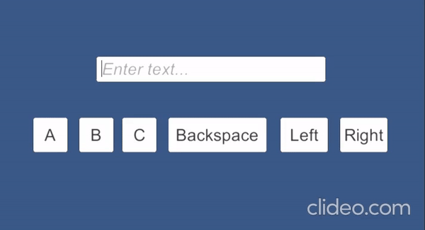
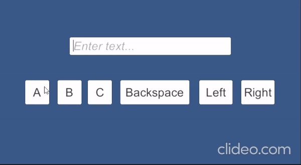
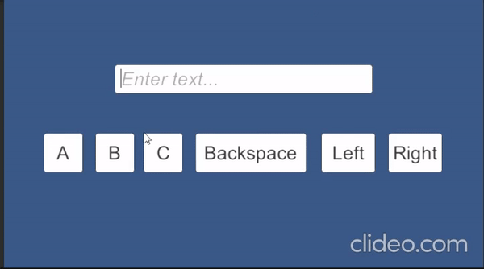
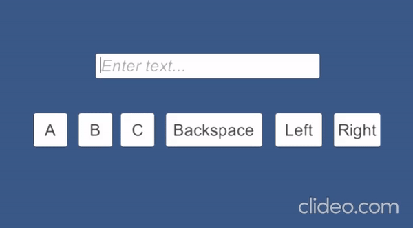

# Infomediji Keyboard
[](https://unity3d.com) 
***

Developed with the [Unity 3D](https://unity.com/) game engine. I've developed the project for Infomediji.

## Features

-Caret must remain in last position.

-Pressing UI button when the text is selected should replace it with corresponding character.
  Selection should dissapear, the caret should move to the position after this symbol.

-Backspace, Left and Right buttons should be implemented. Left and Right buttons should move the cursor over the input field.

-Focus should remain on the input field when the user interface buttons are pressed.

-Virtual keyboard must be consistent and should not interfere with manual input from a real keyboard

-* The bonus is to implement multiple keystrokes on the button hold, as on a real keyboard.


## Installation

Download the repository;
```
git clone https://github.com/cemerdemdeniz/Keyboard.git
```
Go to scene folder and run scene
```
cd KeyboardTask\Assets\Scene
```

## Screenshots






